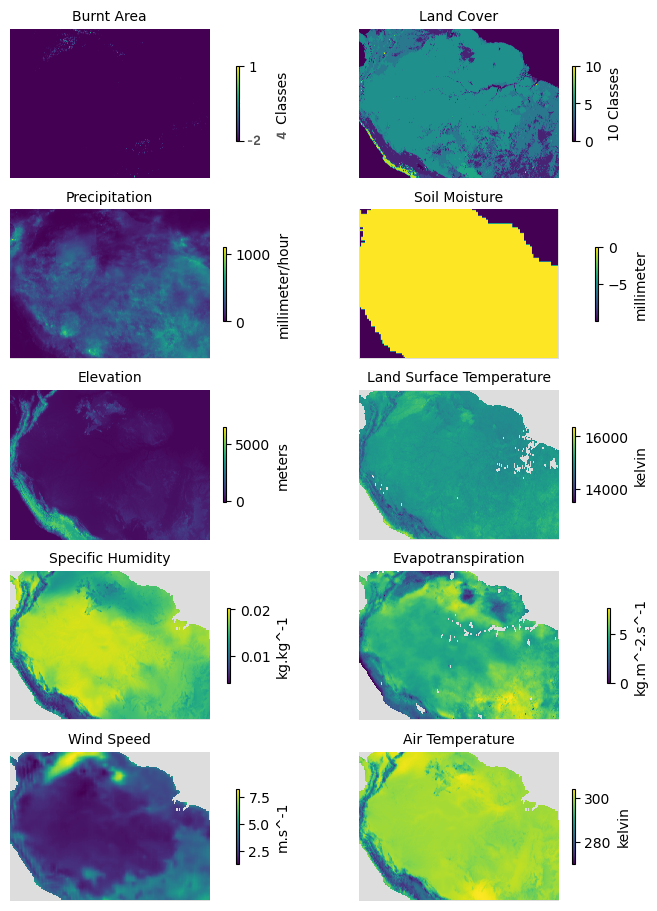

# Amazon Forest Dataset

This repository contains the code and explanation of processes regarding the creation of the Amazon Forest Dataset: A raster-based dataset of covariates related to the spatio-temporal analysis of forest fires for the region of Amazon Rainforest from 2001 to 2020.

Dataset is available at Dryad repository.

## Creation of Amazon Forest Dataset

1. 'gis_processing.txt' contains procedure related to GIS processes, implemented to extract data layers from source, and project them into desired projection system

2. 'main.txt' explains the code and procedure followed to process projected data into working data, by cropping them to Amazon extent and re-sampling them to spatial resolution of 500m

3. 'functions.R' contains the functions for each variable, used in their respective R-based processing explained in 'main.txt'

Each function is generally designed to process as follows: 

a. Create an empty Spatial grid of 500m cell size, with the data extent of Amazon basin boundary 

b. Disaggregate the input raster of variable data to approximately 500m cell size 

c. Transfer the values of the data from disaggregated raster file to empty Spatial Grid

## R processing

Code is similar for all variables (monthly-data) except Land Cover (annual-data) and Elevation (one-time data), which are explained separately in 'main.txt'

Code is designed to follow the below mentioned workflow for each respective month: 

a. Crop the raster based on provided Amazon basin boundary shapefile 

b. Call the respective function for that variable 

c. Save the Spatial Grid developed as output of that applied function
 
 

